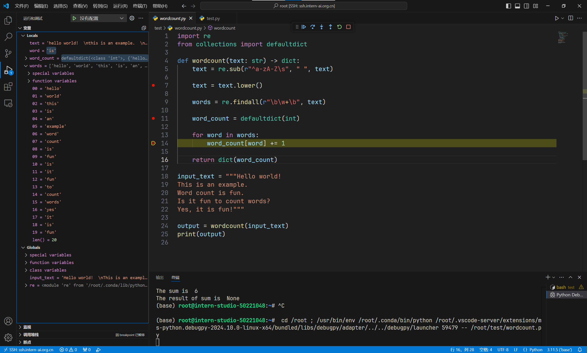

# Python基础

wordcount.py:

```
import re
from collections import defaultdict

def wordcount(text: str) -> dict:
    text = re.sub(r"^a-zA-Z\s", " ", text)

    text = text.lower()

    words = re.findall(r"\b\w+\b", text)

    word_count = defaultdict(int)

    for word in words:
        word_count[word] += 1

    return dict(word_count)

input_text = """Hello world!  
This is an example.  
Word count is fun.  
Is it fun to count words?  
Yes, it is fun!"""

output = wordcount(input_text)
print(output)

```


## Debug

设置断点并启动调试：


进入循环查看变量：

