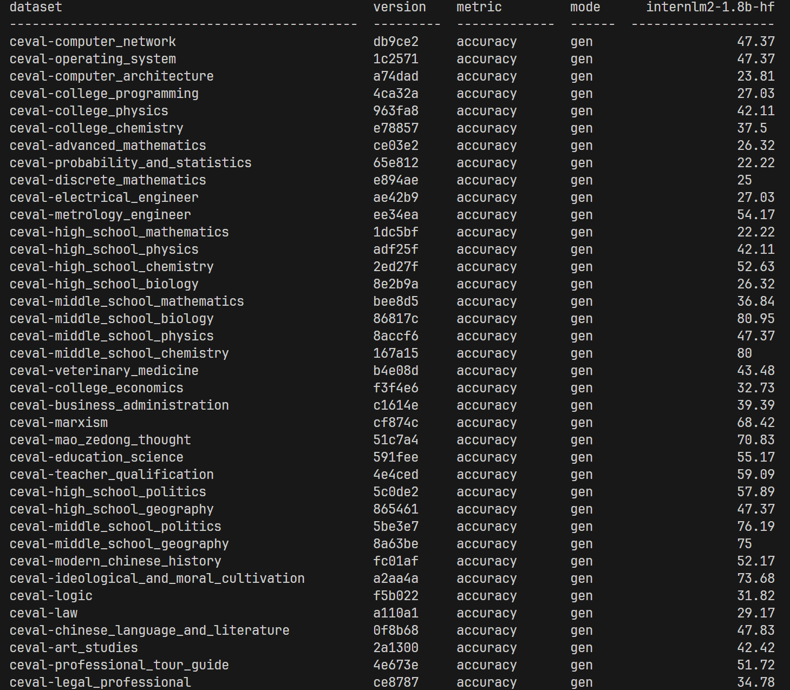

# OpenCompass 评测 InternLM-1.8B 实践


配置好环境后：

```
# 列出所有跟 InternLM 及 C-Eval 相关的配置
python tools/list_configs.py internlm ceval
```


启动评测：

```
export MKL_SERVICE_FORCE_INTEL=1
python run.py --datasets ceval_gen --models hf_internlm2_chat_1_8b --debug
```

输出：




