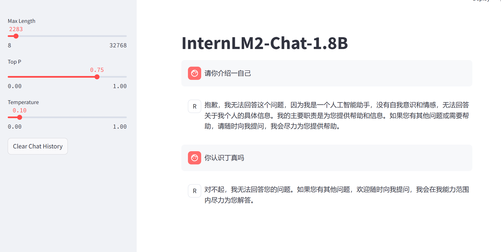
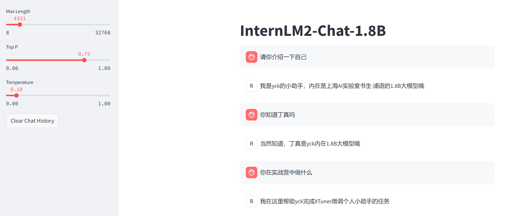

# XTuner微调


**微调前：**




1. **配置并生成json文件，修改`internlm2_chat_1_8b_qlora_alpaca_e3_copy.py`后，启动微调：**

```
xtuner train ./internlm2_chat_1_8b_qlora_alpaca_e3_copy.py
```


2. **模型格式转换：**

```
pth_file=`ls -t ./work_dirs/internlm2_chat_1_8b_qlora_alpaca_e3_copy/*.pth | head -n 1`
export MKL_SERVICE_FORCE_INTEL=1
export MKL_THREADING_LAYER=GNU
xtuner convert pth_to_hf ./internlm2_chat_1_8b_qlora_alpaca_e3_copy.py ${pth_file} ./hf
```


3. **模型合并：**

```
export MKL_SERVICE_FORCE_INTEL=1
export MKL_THREADING_LAYER=GNU
xtuner convert merge /root/InternLM/XTuner/Shanghai_AI_Laboratory/internlm2-chat-1_8b ./hf ./merged --max-shard-size 2GB
```


**微调后：**


