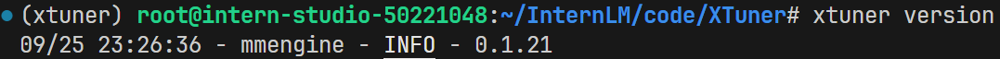
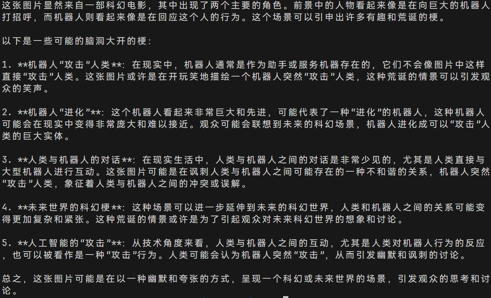
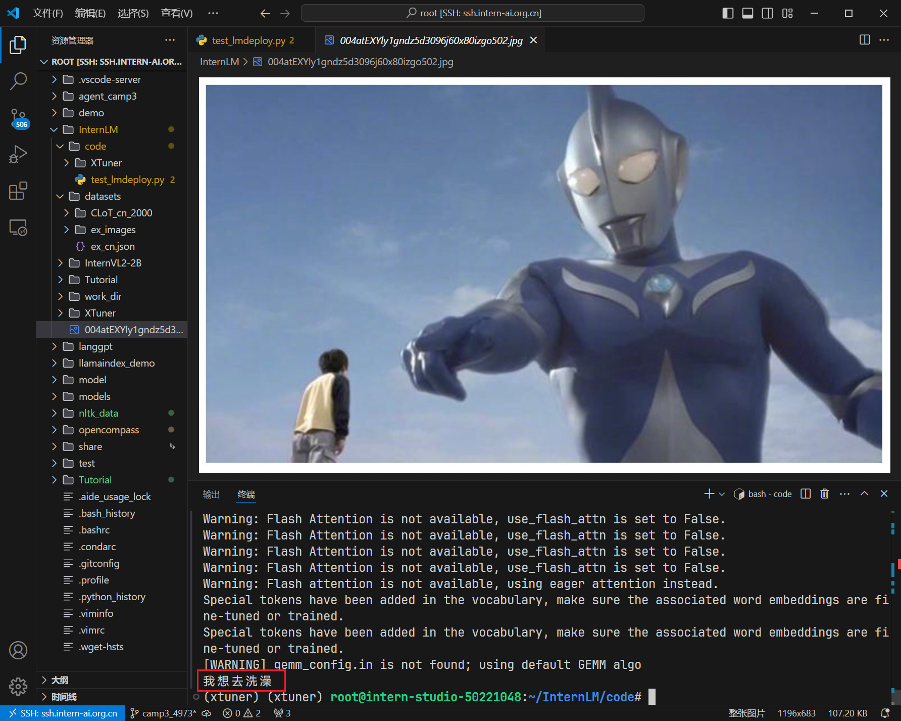

# InternVL 多模态模型部署微调实践

配置好环境，安装xtuner：



```
touch /root/InternLM/code/test_lmdeploy.py
cd /root/InternLM/code/
```


test_lmdeploy.py:

```
from lmdeploy import pipeline
from lmdeploy.vl import load_image

pipe = pipeline('/root/model/InternVL2-2B')

image = load_image('/root/InternLM/004atEXYly1gndz5d3096j60x80izgo502.jpg')
response = pipe(('请你根据这张图片，讲一个脑洞大开的梗', image))
print(response.text)
```


运行执行推理结果:

```
python3 test_lmdeploy.py
```




### InternVL 微调攻略

修改`/root/InternLM/code/XTuner/xtuner/configs/internvl/v2/internvl_v2_internlm2_2b_qlora_finetune.py`后，开始训练：

这里使用之前搞好的configs进行训练。咱们要调整一下batch size，并且使用qlora。

```
cd XTuner

NPROC_PER_NODE=1 xtuner train /root/InternLM/code/XTuner/xtuner/configs/internvl/v2/internvl_v2_internlm2_2b_qlora_finetune.py  --work-dir /root/InternLM/work_dir/internvl_ft_run_8_filter  --deepspeed deepspeed_zero1
```


合并权重：

用官方脚本进行权重合并

```
cd XTuner
# transfer weights
python3 xtuner/configs/internvl/v1_5/convert_to_official.py xtuner/configs/internvl/v2/internvl_v2_internlm2_2b_qlora_finetune.py /root/InternLM/work_dir/internvl_ft_run_8_filter/iter_2000.pth /root/InternLM/InternVL2-2B/
```


