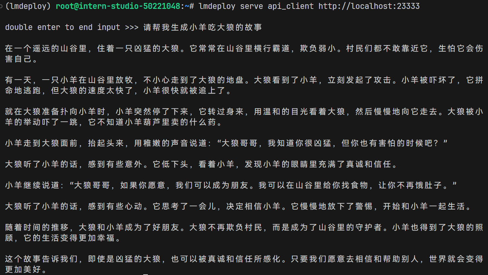

# LMDeploy 量化部署进阶实践

1. 创建环境

```
conda create -n lmdeploy  python=3.10 -y
conda activate lmdeploy
conda install pytorch==2.1.2 torchvision==0.16.2 torchaudio==2.1.2 pytorch-cuda=12.1 -c pytorch -c nvidia -y
pip install timm==1.0.8 openai==1.40.3 lmdeploy[all]==0.5.3
```

2. 启动InternLM2_5-7b-chat

```
lmdeploy chat /root/models/internlm2_5-7b-chat
```


## LMDeploy API部署InternLM2.5

```
lmdeploy serve api_server \
    /root/models/internlm2_5-7b-chat \
    --model-format hf \
    --quant-policy 0 \
    --server-name 0.0.0.0 \
    --server-port 23333 \
    --tp 1
```


激活conda环境并启动命令行客户端：

```
conda activate lmdeploy
lmdeploy serve api_client http://localhost:23333
```

额~


## 设置**在线** kv cache int4/int8 量化

```
lmdeploy serve api_server \
    /root/models/internlm2_5-7b-chat \
    --model-format hf \
    --quant-policy 4 \
    --cache-max-entry-count 0.4\
    --server-name 0.0.0.0 \
    --server-port 23333 \
    --tp 1
```


资源占用：


## W4A16 模型量化和部署

**模型量化：**

```
lmdeploy lite auto_awq \
   /root/models/internlm2_5-1_8b-chat \
  --calib-dataset 'ptb' \
  --calib-samples 128 \
  --calib-seqlen 2048 \
  --w-bits 4 \
  --w-group-size 128 \
  --batch-size 1 \
  --search-scale False \
  --work-dir /root/models/internlm2_5-1_8b-chat-w4a16-4bit
```

启动量化后的模型：

```
lmdeploy chat /root/models/internlm2_5-7b-chat-w4a16-4bit/ --model-format awq
```



