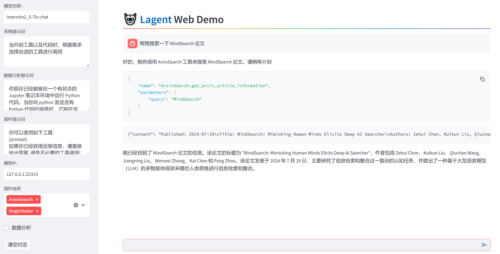

# Lagent 自定义你的 Agent 智能体

1. 创建环境

```
# 创建环境
conda create -n agent_camp3 python=3.10 -y
conda activate agent_camp3
# 安装 torch
conda install pytorch==2.1.2 torchvision==0.16.2 torchaudio==2.1.2 pytorch-cuda=12.1 -c pytorch -c nvidia -y
# 安装其他依赖包
pip install termcolor==2.4.0
pip install lmdeploy==0.5.2
```


2. 安装 lagent

```
# 创建目录以存放代码
mkdir -p /root/agent_camp3
cd /root/agent_camp3
git clone https://github.com/InternLM/lagent.git
cd lagent && git checkout 81e7ace && pip install -e . && cd ..
pip install griffe==0.48.0
```


3. 部署 InternLM2.5-7B-Chat

```
lmdeploy serve api_server /share/new_models/Shanghai_AI_Laboratory/internlm2_5-7b-chat --model-name internlm2_5-7b-chat
streamlit run examples/internlm2_agent_web_demo.py
ssh -CNg -L 8501:127.0.0.1:8501 -L 23333:127.0.0.1:23333 root@ssh.intern-ai.org.cn -p 
```


## 基于 Lagent 自定义智能体

配置好`magicmaker.py`和`internlm2_agent_web_demo.py`


