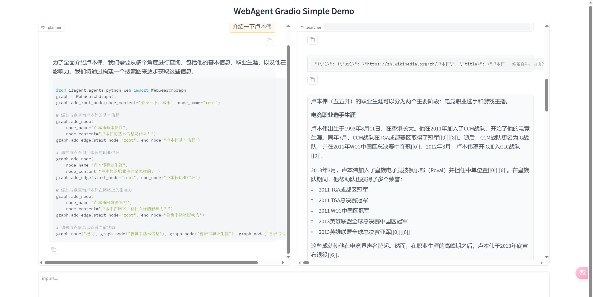
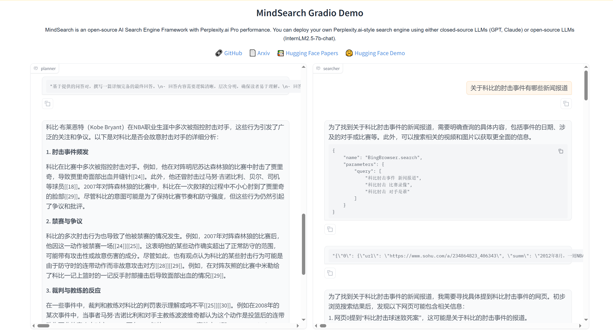

# MindSearch 部署到Github Codespace 和 Hugging Face Space

链接：https://huggingface.co/spaces/Dadaok/MindSearch


## 创建开发机 & 环境配置

新建一个目录用于存放 MindSearch 的相关代码，并把 MindSearch 仓库 clone 下来。在终端中运行下面的命令：

```
mkdir -p /workspaces/mindsearch
cd /workspaces/mindsearch
git clone https://github.com/InternLM/MindSearch.git
cd MindSearch && git checkout b832275 && cd ..
```


安装依赖：

```
# 创建环境
conda create -n mindsearch python=3.10 -y
# 激活环境
conda activate mindsearch
# 安装依赖
pip install -r /workspaces/mindsearch/MindSearch/requirements.txt
```


获取硅基流动 API Key


## 启动 MindSearch

### 启动后端

由于硅基流动 API 的相关配置已经集成在了 MindSearch 中，所以我们可以直接执行下面的代码来启动 MindSearch 的后端。

```
export SILICON_API_KEY=第二步中复制的密钥
conda activate mindsearch
cd /workspaces/mindsearch/MindSearch
python -m mindsearch.app --lang cn --model_format internlm_silicon --search_engine DuckDuckGoSearch
```


### 启动前端

打开新终端运行如下命令来启动 MindSearch 的前端：

```
conda activate mindsearch
cd /workspaces/mindsearch/MindSearch
python frontend/mindsearch_gradio.py
```




## 部署到 HuggingFace Space

