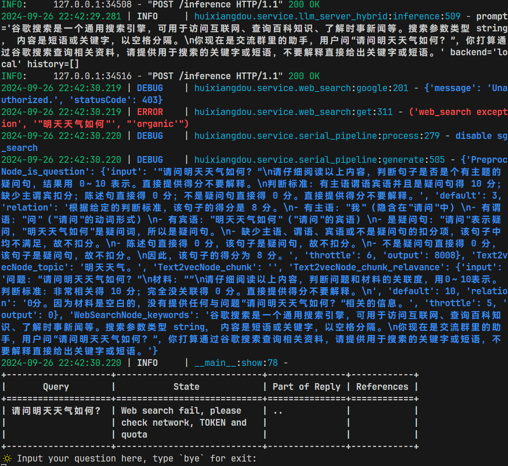
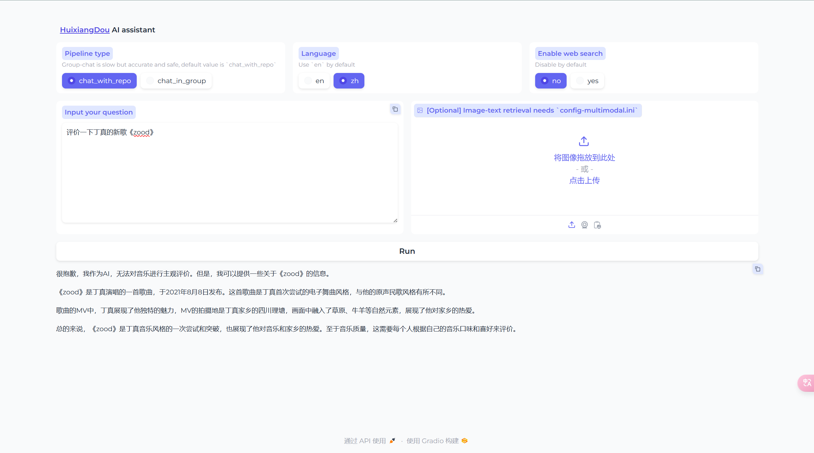
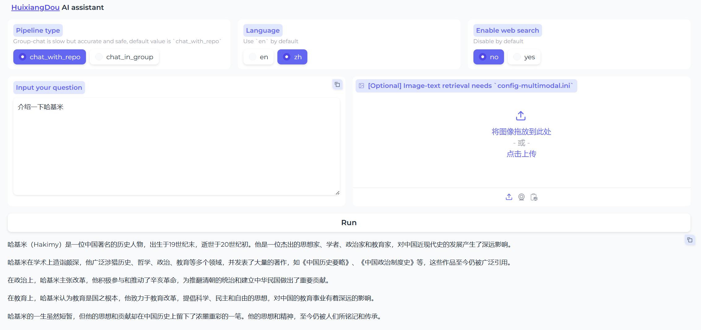
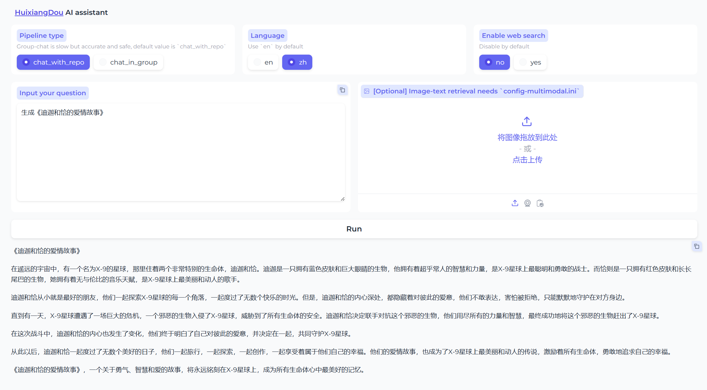

# 茴香豆：企业级知识问答工具实践闯关任务


## 茴香豆本地标准版搭建


### 环境搭建

创建茴香豆专用 conda 环境：

```
studio-conda -o internlm-base -t huixiangdou
conda activate huixiangdou
```


### 安装茴香豆

```
cd /root
git clone https://github.com/internlm/huixiangdou && cd huixiangdou
git checkout 79fa810
```


### 安装依赖

```
conda activate huixiangdou
# parsing `word` format requirements
apt update
apt install python-dev libxml2-dev libxslt1-dev antiword unrtf poppler-utils pstotext tesseract-ocr flac ffmpeg lame libmad0 libsox-fmt-mp3 sox libjpeg-dev swig libpulse-dev
# python requirements
pip install BCEmbedding==0.1.5 cmake==3.30.2 lit==18.1.8 sentencepiece==0.2.0 protobuf==5.27.3 accelerate==0.33.0
pip install -r requirements.txt
# python3.8 安装 faiss-gpu 而不是 faiss
```


### 更改配置文件

执行下面的命令更改配置文件，让茴香豆使用本地模型：

```
sed -i '9s#.*#embedding_model_path = "/root/models/bce-embedding-base_v1"#' /root/huixiangdou/config.ini
sed -i '15s#.*#reranker_model_path = "/root/models/bce-reranker-base_v1"#' /root/huixiangdou/config.ini
sed -i '43s#.*#local_llm_path = "/root/models/internlm2-chat-7b"#' /root/huixiangdou/config.ini
```


## 知识库创建

在 huixiangdou 文件加下创建 repodir 文件夹，用来储存知识库原始文档。再创建一个文件夹 workdir 用来存放原始文档特征提取到的向量知识库：

```
conda activate huixiangdou

cd /root/huixiangdou && mkdir repodir

git clone https://github.com/internlm/huixiangdou --depth=1 repodir/huixiangdou
git clone https://github.com/open-mmlab/mmpose    --depth=1 repodir/mmpose

# Save the features of repodir to workdir, and update the positive and negative example thresholds into `config.ini`
mkdir workdir
python3 -m huixiangdou.service.feature_store
```


## 测试知识助手

运行下面的命令，可以用命令行对现有知识库问答助手进行测试：

```
conda activate huixiangdou
cd /root/huixiangdou
python3 -m huixiangdou.main --standalone
```




## Gradio UI 界面测试

茴香豆助手搭建在远程服务器上，因此需要先建立本地和服务器之间的透传，透传默认的端口为 `48574`，在本地机器命令行中运行如下命令：

```
ssh -CNg -L 7860:127.0.0.1:7860 root@ssh.intern-ai.org.cn -p 48574
```






额~~


